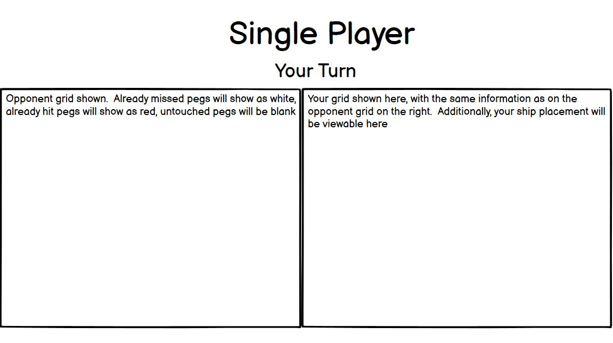
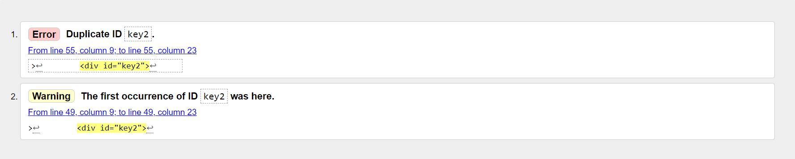

# RockPaperScissors

<a href="" target="_blank">View the live site here</a>

# Contents

* [Project Overview](#project-overview)
* [User Experience Design](#user-experience-design)
   * [Strategy](#strategy)
   * [Scope](#scope)
   * [Structure](#structure)
   * [Skeleton](#skeleton)
   * [Surface](#surface)
* [Technologies Used](#technologies-used)
* [Testing](#testing)
* [Deployment](#deployment)
* [Credits](#credits)

<small><i><a href='http://ecotrust-canada.github.io/markdown-toc/'>Table of contents generated with markdown-toc</a></i></small>

# Project Overview

A site on which to play the game rock, paper, scissors against the computer.  

Users are first taken to a home page explaining the site, offering a key for the game symbols, and inviting the user to give feedback. The user can then select the available header links to the "play" and "feedback" pages to play the game or submit a feedback form. 

The site is free to use and mobile responsive.  

# User Experience Design

## Strategy

Designed for fans of the game, this site offers an online platform on which the player can test themselves against the computer. The running score is tallied and eventually a winner will be declared.  

It is also designed for users needing a simulation of the results of the game. Any user who needs to use chance to determine a winner of some kind in a competition can simply obtain input from the competitor, and pit it against the computer.  

### Target Audience

This site is targeted towards users of any age with some knowledge of the game, looking to play versus the computer.  

## Scope

**Features**

- The site contains three pages, the Home page, Play page, and Feedback page. The header and footer are identical on all three of these pages. 
- The header, at the top of any page, contains a nav bar inside a gradient background, with links to all three of the pages of the site.  

- The footer, at the bottom of any page, contains icons representing four major social media platforms; Facebook, Twitter, Instagram, and YouTube. At the moment these links simply take the user to the landing pages for each of those platforms, as no social media exists for this site independently.  

- ### Home page 
This page is the landing page for users, on which they can read a brief introduction, examine the key for the game, and read the site suggestion to offer feedback in the third message.  

- ### Play page 
This page is the core of the site, on which users can play the game. The three options are presented below, and enlarged when hovered over to indicate which option the user is selecting. When the user makes a choice, a section near the bottom of the page displays their choice, what the computer chose, and who won the point.  

Upon winning/losing, which arrives at the 6th point, users are given a message like this, after which the site refreshes with scores back to 0.  

- ### Feedback page

**Future Features**
- This site could add the lizard and spock choices to the game to make it slightly more complex, and increase the variability of input and response.  
- Another possible addition would be to add a separate section offering a chance to pit the player against a second user.  

## Structure

The structure is quite simple, with three pages: index, play, and contact. 

## Skeleton

The wireframes below look different from the end result of the site, due to a major pivot midway through the project.  Originally it was designed to be the game of battleship, as the wireframs reflect, but after complications the game design was amended. The feedback page was also added after the wireframing process.  

## Surface

**Typography**

The site uses PT Serif typeface throughout, with Sans-Serif as a back up, with fonts originating from [Google Fonts](https://fonts.google.com/specimen/PT+Serif)

**Color Scheme**

It seemed ideal to choose a blue based color scheme for this project, which prompted the initial search for a range of blue hues and complementary colors. 

The site [Scheme Color](https://www.schemecolor.com/i-am-smart.php) was used to provide the color scheme.  

# Validation

All html was validated using W3C validation. The following duplicate key on the home page was the only item to amend.  

All CSS was validated using Jigsaw. The following 10 changes were all amended.  

All JavaScript was validated using JShint. The following two missing semicolons were added. 

The README.md file was copied and pasted into a Google doc, to evaluate possible spelling and grammatical errors. No mistakes were found.  

# Technologies Used

This project uses the following languages and was created on Github:
* HTML5
* CSS
* JavaScript
* Chrome--Chrome devtools were used to debug and test the site.
* Github--Github was used to create the repository, and all commits were pushed through Github.
* Gitpod--Gitpod was used as the main editor for the site.
* balsamiq--wireframes were created using a balsalmiq template. 
* W3C HTML Validator
* Jigsaw CSS validator
* JShint JavaScript validator
* README validator--Google docs auto spell-check was used to check the pasted content of the README for spelling and grammar. 

# Deployment

# Credits
- Main code for the dynamic background on the home and contact pages was taken from the provided project https://top-chef-kelvin.herokuapp.com
- The gradient background of the nav bar on all three pages was taken from https://cssgradient.io/
- The color scheme was taken from https://www.schemecolor.com/i-am-smart.php
- The font family was taken from https://fonts.google.com/specimen/PT+Serif
- The lines of code styling the font inside the text area on lines 298-301 of the style.css page were taken from https://stackoverflow.com/questions/47357063/vertically-align-an-input-placeholder-with-css-or-set-line-height?noredirect=1&lq=1 
- The icons for the social media links and the game itself were taken from https://fontawesome.com/
- Header content closely follows the header laid out in the Code Institute Lesson "Creating your first gitpod project. Credit to https://codeinstitute.net/se/
- Footer content closely follows and is copied from the footer created in the Love Running project. Credit to https://codeinstitute.net/se/
- While main structure is significantly different, some general structural ideas in code lines 11-23 in the script.js file were derived from the following walkthrough on creating a rock paper scissors game: https://www.youtube.com/watch?v=1yS-JV4fWqY&ab_channel=WebDevSimplified
- Overall layout, structure, and some wording of README.md document came from using https://github.com/JoGorska/hackathon-team-1 as a template--this was a project on which I worked as part of a hackathon.  

